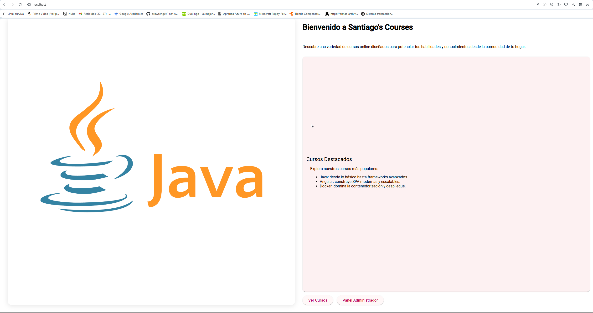
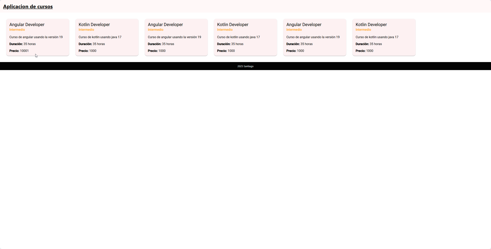
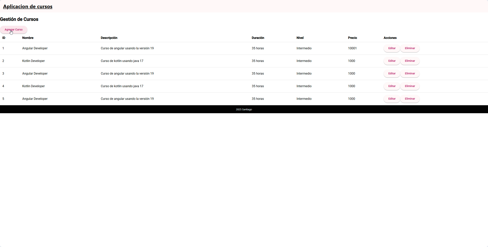

# 📘 Aplicación Angular - Gestión de Cursos

Esta es una aplicación construida con Angular que permite visualizar y editar cursos de manera sencilla. A continuación se describe el flujo de uso de la aplicación.

---

## 🚀 Página Inicial

Al ingresar a la aplicación, se muestra una pantalla con dos botones principales:

- **Ver Cursos**: Lleva a la pantalla donde se listan todos los cursos.
- **Editar Cursos**: Redirige a la sección de edición y creación de cursos.

Ambos botones están acompañados de imágenes ilustrativas para mejorar la experiencia de usuario.

> 📸 Ejemplo:

| Página Inicial |
|----------------|
|  |

---

## 📚 Página de Visualización de Cursos

En esta sección se muestran los cursos registrados en forma de tarjetas . 

> 📸 Ejemplo:

| Cursos disponibles |
|--------------------|
|  |

---

## ✏️ Página de Edición / Creación de Cursos

Desde aquí puedes:

- Crear nuevos cursos
- Editar los cursos existentes
- Eliminar cursos


> 📸 Ejemplo:

| Editor de Cursos |
|------------------|
|  |

---

## 🛠️ Tecnologías Utilizadas

- Angular 17+
- Angular Material
- Docker
- TypeScript
- HTML/CSS

---

## 📦 Cómo ejecutar en Docker

1. Clona el repositorio:

   ```bash
   git clone https://github.com/MSCastilloP/proyectoFinal
   cd tu-repo
